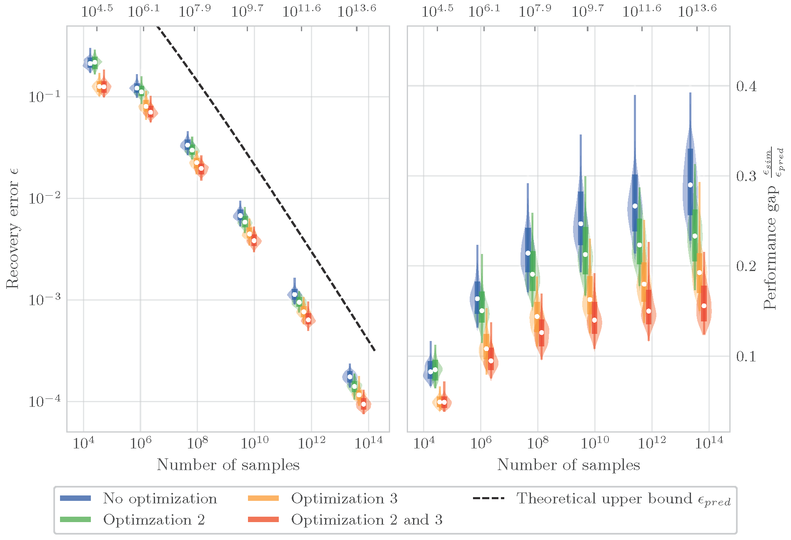

# Quantum Hamiltonian Learning

This repository contains the implementation of a Quantum Hamiltonian Learning protocol. The protocol aims to estimate the coefficients of a sparsely interacting Hamiltonian by leveraging the dynamics of the system under unitary evolution. Details are in the [manuscript](https://arxiv.org/abs/2206.15464).

## Problem Formulation

The Hamiltonian learning problem involves inferring the coefficients of a Hamiltonian on an $n$-qubit system. The Hamiltonian is expressed as a sum of Pauli operators with corresponding coefficients. The goal is to determine the unknown coefficients with a certain level of accuracy, given knowledge of the Hamiltonian structure.

Consider a Hamiltonian $H$ with the following expansion in the Pauli basis:
$$
H = \sum_{m=1}^r \theta_m P_m.
$$
Here, each $P_m$ is a Pauli operator from the set $\{I,\sigma_x,\sigma_y,\sigma_z\}$ acting on $n$ qubits. The coefficients $\theta_m$ represent the unknown Hamiltonian coefficients. We assume that the Hamiltonian structure (i.e., which Paulis $P_m$ are present) is known, but the coefficients are unknown.

### Data Access

The Hamiltonian learning problem can be approached using two types of data access:

1. **Unitary Evolution**: The system can be prepared in an initial product state $\rho_0$ and evolved for a specified time $t$. Measurements of Pauli observables can be made on the time-evolved state.
2. **Gibbs States**: The system can be prepared in a Gibbs state at a specified temperature $\beta^{-1}$. Measurements of Pauli observables can be made on the Gibbs state.

### Objective

The objective of the Hamiltonian learning problem is to estimate the coefficients $\theta_m$ of the Hamiltonian, up to an additive error `ε` multiplied by the maximum absolute value of the coefficients. The estimation should have a success probability of at least $1-\delta$.

## Sparsely Interacting Hamiltonian

A key notion in this work is a `sparsely interacting Hamiltonian'. This refers to a Hamiltonian with a specific structure in its interactions. The interaction graph of the Hamiltonian provides insights into its sparsity.

### Interaction Graph

The interaction graph (also known as the "dual" interaction graph) of a Hamiltonian $H$ consists of a set of vertices and edges.

- Vertices: Each vertex represents a Pauli operator $P_m$ in the Hamiltonian, where $m$ ranges from $1$ to $r$ (the total number of Pauli operators).
- Edges: Edges exist between vertices $P_i,P_j$ if the support of their corresponding Pauli operators overlap, and $i \neq j$.

The support of a Pauli operator $P$ refers to the set of qubits on which the operator acts nontrivially.

### Degree of the Hamiltonian

The degree $\mathcal{D}$ of the Hamiltonian represents the maximum degree of any vertex in the interaction graph:
$$
\mathcal{D} = \max_v \text{deg}(v)
$$

A sparsely interacting Hamiltonian is characterized by having a degree $\mathcal{D}$ that is independent of the system size $n$. This class of Hamiltonians includes geometrically $k$-local Hamiltonians, where the number of terms overlapping with any Pauli term depends only on $k$.

For instance, the following is the interaction graph for a 10-qubit transverse field Ising model.

The coloring shown on the right is used to do simultaneous inference of many Hamiltonian coefficients (see Section IV B of [the manuscript](https://arxiv.org/abs/2206.15464)).

## Simulations

We include a notebook `simulations.ipynb` that simulates an 80-qubit transverse field Ising model. The function `ham_learn` accepts three parameters: a graph `G` representing the Hamiltonian interaction graph, `eps` corresponding to $\epsilon$, `delta` corresponding to $\delta$, `add_noise` which simply tells us whether we want to add the effects of shot noise into the simulation, and finally `optimizations`. The `optimizations` parameter is a boolean array of length 3, and indicates whether we want to activate the three heuristic optimizations discussed in Appendix F of the manuscript.

The numerical results are shown below.

